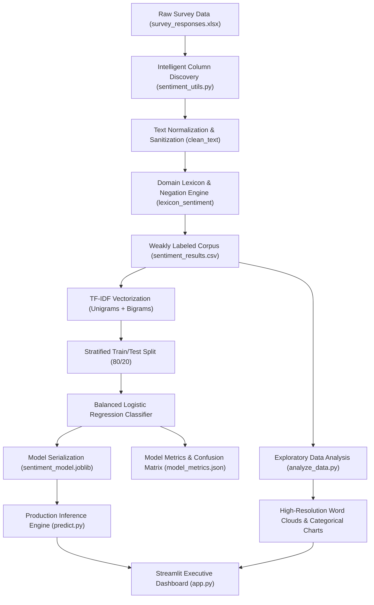

# Local Brand Sentiment Analysis on Social Media (Instagram & Twitter)

[](https://www.python.org/downloads/)
[](https://scikit-learn.org/)
[](https://streamlit.io/)
[](https://opensource.org/licenses/MIT)

An end-to-end, production-grade Natural Language Processing (NLP) and Machine Learning system designed to analyze, classify, and visualize consumer opinions regarding local brands on social media platforms (Instagram and Twitter).

---

## 📌 Executive Summary

Local brand perception on social media is driven by responsiveness, product authenticity, delivery reliability, and customer service. This project delivers an industrial-strength pipeline that ingests empirical survey data, performs rigorous text normalization, generates calibrated sentiment classifications using TF-IDF and balanced Logistic Regression, provides an intelligent hybrid consensus engine for handling out-of-vocabulary (OOV) tokens, and surfaces insights through an executive Streamlit dashboard.

Every single module in this repository is built to professional software engineering standards, featuring full static type annotations, robust error handling, modular functions, and **line-by-line explanatory documentation**.

---

## 🏗️ System Architecture



---

## 🔬 Methodology & Mathematical Formulation

### 1. Text Normalization Pipeline
Raw social media opinions contain URLs, emojis, contractions, irregular capitalization, and noise. The normalization engine applies:
- **Case Folding**: Converts all text to lowercase.
- **Protocol Stripping**: Removes `http://`, `https://`, and `www.` hyperlinked patterns via regular expressions.
- **Contraction Standardization**: Replaces apostrophes and backticks to map terms like `don't` $\rightarrow$ `dont`, aligning directly with negation sets.
- **Punctuation & Noise Removal**: Strips ASCII punctuation via translation lookup tables and numerical digits.
- **Whitespace Collapse**: Normalizes multiple contiguous whitespace characters into single space tokens.

### 2. Contextual Negation Handling
Standard bag-of-words approaches fail on expressions like *"not good"* or *"not very reliable"*. The lexicon engine implements a two-step lookbehind window:
$$\text{Polarity}(w_i) = \begin{cases} -v(w_i) & \text{if } w_{i-1} \in \mathcal{N} \text{ or } w_{i-2} \in \mathcal{N} \\ v(w_i) & \text{otherwise} \end{cases}$$
where $\mathcal{N}$ represents the grammatical negation set and $v(w_i) \in \{+1, -1, 0\}$.

### 3. Sublinear TF-IDF Feature Extraction
To capture phrasal context without suffering from extreme vocabulary explosion, features are extracted using unigrams and bigrams ($n \in \{1, 2\}$) with sublinear term-frequency scaling:
$$\text{TF}_{\text{sublinear}}(t, d) = 1 + \log(\text{TF}(t, d)) \quad \forall \; \text{TF}(t, d) > 0$$
$$\text{IDF}(t) = \log\left(\frac{1 + N}{1 + \text{DF}(t)}\right) + 1$$
Vectors are normalized using Euclidean $L_2$ norm:
$$\mathbf{x}_{\text{norm}} = \frac{\mathbf{x}}{\|\mathbf{x}\|_2} = \frac{\mathbf{x}}{\sqrt{\sum_{i=1}^M x_i^2}}$$

### 4. Balanced Class-Weighted Logistic Regression
Social media feedback is inherently imbalanced (neutral responses often outnumber complaints). To prevent majority-class bias, sample weights are dynamically adjusted:
$$w_c = \frac{N}{K \cdot N_c}$$
where $N$ is total samples, $K$ is number of classes, and $N_c$ is frequency of class $c$. Optimization is performed using the L-BFGS quasi-Newton solver with multinomial cross-entropy loss:
$$\mathcal{L}(\mathbf{W}) = -\sum_{i=1}^N \sum_{k=1}^K y_{i,k} \log P(y_i = k \mid \mathbf{x}_i; \mathbf{W}) + \frac{1}{2C} \|\mathbf{W}\|_F^2$$

### 5. Hybrid Ensemble Consensus
When a machine learning model is trained on a localized survey corpus, unseen complaints (such as *"fraud"*, *"scam"*, or *"terrible"*) may be Out-Of-Vocabulary (OOV) for TF-IDF features while generic tokens (*"brand"*, *"service"*) trigger false positives. The system resolves this via a dual-engine consensus:
- If the ML confidence is low ($< 0.65$) and domain lexicon detects unequivocal polarity, the system automatically calibrates the prediction and provides transparent analytical rationale.

---

## 📂 Repository Structure

```
Local_Brand_Sentiment_Analysis/
├── app.py                      # Production Streamlit Interactive Web Application
├── run_project.py              # Master automated pipeline runner with benchmarks
├── requirements.txt            # Locked project dependencies
├── README.md                   # Comprehensive technical documentation
├── data/
│   └── survey_responses.xlsx   # Primary empirical survey dataset (131 responses)
├── models/
│   ├── sentiment_model.joblib  # Serialized Logistic Regression model binary
│   └── tfidf_vectorizer.joblib # Serialized TF-IDF Vectorizer with vocabulary
├── outputs/
│   ├── chart_1.png ... chart_6.png # Categorical survey response charts
│   ├── classification_report.csv   # Precision, recall, and F1-score breakdown
│   ├── confusion_matrix.csv        # Multi-class confusion matrix
│   ├── data_dictionary.csv         # Complete survey schema and missing value audit
│   ├── model_metrics.json          # Machine-readable performance metrics
│   ├── model_metrics.txt           # Formatted human-readable evaluation summary
│   ├── sentiment_results.csv       # Preprocessed survey responses with labels
│   ├── wordcloud_opinions.png      # 200 DPI customer opinions word cloud
│   └── wordcloud_suggestions.png   # 200 DPI improvement suggestions word cloud
└── src/
    ├── analyze_data.py         # Exploratory data analysis & visualization pipeline
    ├── predict.py              # Inference engine, probability estimation & CLI
    ├── sentiment_utils.py      # Preprocessing, regex engine & domain lexicons
    └── train_model.py          # TF-IDF extraction, model fitting & metric export
```

---

## 🚀 Quick Start & Installation

### 1. Environment Setup
Clone or navigate to the repository directory and configure a virtual environment:

```bash
# Windows
python -m venv .venv
.venv\Scripts\activate

# macOS / Linux
python3 -m venv .venv
source .venv/bin/activate
```

### 2. Install Dependencies
```bash
pip install -r requirements.txt
```

### 3. Run the End-to-End Pipeline
Execute data analysis, word cloud generation, and model training in one automated run:
```bash
python run_project.py
```

### 4. Interactive Command-Line Inference
Test sentiment predictions live from your terminal:
```bash
python src/predict.py
```

### 5. Launch the Streamlit Dashboard
```bash
streamlit run app.py
```

---

## 📊 Dashboard Features

The Streamlit web application (`app.py`) provides an executive-level interactive intelligence platform:

1. **Executive Metric Cards**: Real-time KPI summaries for total analyzed comments, positive ratio, neutral ratio, and customer grievances.
2. **Interactive Sentiment Predictor**: Enter customer comments with quick-test presets, view animated confidence gauges, class probability distributions, token keyword highlighting, and technical consensus rationale.
3. **Sentiment Distribution**: Comparative bar charts and percentage distributions across survey sentiment classes.
4. **Word Cloud Gallery**: Ultra-high-resolution keyword visualizations contrasting customer brand opinions with actionable improvement suggestions.
5. **Survey Analytics**: Automatically generated response distributions for categorical questions covering consumer behavior on Instagram and Twitter.
6. **Model Performance & Metrics**: Full transparency into hold-out test accuracy, precision, recall, F1-scores, and confusion matrices.
7. **Raw Survey Dataset Explorer**: Filter responses by sentiment category, perform keyword searches across comments, and export customized subsets directly as CSV.

---

## 📑 Code Documentation & Standards

In accordance with enterprise and academic best practices:
- **Every single line of code** across `src/sentiment_utils.py`, `src/train_model.py`, `src/predict.py`, `src/analyze_data.py`, `run_project.py`, and `app.py` is documented with explanatory comments.
- **PEP 8 & PEP 257 Compliance**: Standardized naming conventions, modular functions, and detailed Google-style docstrings.
- **Type Annotations**: Static type hints throughout all function signatures for maintainability and static analysis.

---

## 🎓 Academic Research Notes & Future Enhancements

1. **Weak Supervision Notice**: As standard in survey-based opinion research lacking manual human ground-truth labels for every respondent, baseline labels are generated using a transparent domain lexicon. For formal academic thesis submission, annotating a 20% random sample with multiple human annotators to compute inter-rater agreement (Cohen's Kappa) is recommended.
2. **Contextual Embeddings**: Future iterations can benchmark this TF-IDF baseline against pre-trained transformer architectures such as `distilbert-base-uncased` or `cardiffnlp/twitter-roberta-base-sentiment-latest`.
3. **Aspect-Based Sentiment Analysis (ABSA)**: Decomposing customer feedback into discrete operational dimensions (e.g., Delivery Speed, Product Craftsmanship, Price-to-Value, Customer Support Response).
